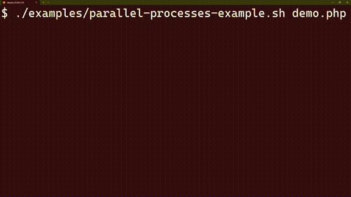

---
hide:
  - toc
---

# Presentation

`parallel-processes` is an open-source PHP library for running multiple processes in parallel.

# Key features

-   :material-docker:{ .lg .middle } __Install it or use Docker images__

    ---

    Install it as a Composer dependency or use the provided Docker images to avoid a local installation.

    [:octicons-arrow-right-24: Installation](installation/composer-dependency.md)

-   :material-file-tree:{ .lg .middle } __Process start rules__

    ---

    Configure when a process should start: immediately, after another process, during bootstrap, or during teardown.

    [:octicons-arrow-right-24: Bootstrap or tear down](usage/bootstrap-tear-down.md)

-   :material-cog-outline:{ .lg .middle } __Process configuration__

    ---

    Configure each process: name, command, maximum execution time, output verbosity, etc.

    [:octicons-arrow-right-24: Configure process](usage/process-configuration/miscellaneous.md)

-   :material-cog-outline:{ .lg .middle } __Execution configuration__

    ---

    Configure execution settings for your processes using PHP: process order, refresh interval, timeout, etc.

    [:octicons-arrow-right-24: Minimal configuration](usage/minimal-configuration.md)

-   :material-message-bulleted:{ .lg .middle } __Verbosity__

    ---

    Control output verbosity: show process output, execution time, only errors, or all outputs.

    [:octicons-arrow-right-24: Output verbosity](usage/output-verbosity.md)

-  :material-compare:{ .lg .middle } __Theme__

    ---

    Choose between the Default and Summary themes, or create a custom theme.

    [:octicons-arrow-right-24: Theme configuration](theme/configuration.md)

# License

`parallel-processes` is licensed under the [Apache 2.0 License](getting-started/license.md).

# Links

GitHub: [steevanb/php-parallel-processes](https://github.com/steevanb/php-parallel-processes)

Docker Hub: [steevanb/php-parallel-processes](https://hub.docker.com/r/steevanb/php-parallel-processes)

Creator: [Steevan BARBOYON](http://prestation.info-droid.fr/)
